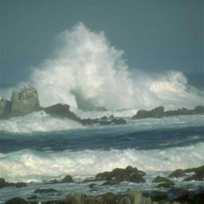
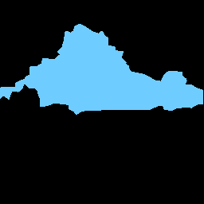
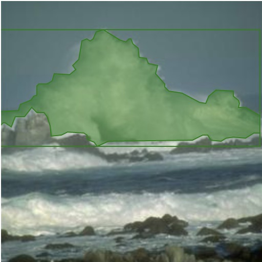

# MaskCoco
MaskCoco is a simple script that parse masked images to coco format for object segmentation. 

## Install
Simply run the following in terminal
```
git clone https://github.com/georgezywang/MaskCoco.git
```
Additionally, this script expects the following libraries:
```
pathlib #pip install pathlib
PIL
numpy
skimage
shapely
```
as well as some built in ones. Use conda or pip to install missing dependencies

## Play with the Demo
The demo parses a mask of a wave image[1] and displays an annotated image.
Wave Image   |  mask
:-------------------------:|:-------------------------:
  |  
which can both be found in the images folder.

To play with this demo, run the following:
```
cd MaskCoco
python3 driver.py
```
Open `display.ipynb` and run the cell. An annotated wave image should appear. A bounding box and a mask should be present in the image.


<p align = "center">
Annotated Wave Image
</p>
The visualizer utilizes code was taken from kaggle [2]. To change the mask's color, or display more information, please visit the link in the references section. This script was also inspired by this post [3].

## Using Custom Dataset
To use a custom dataset, make changes in the `driver.py` file. MaskCoco.MaskParser has two required arguments, being the category dictionary and a list of images. The list of images should be initialized using the ImageLabel class from `MaskCoco.py`. If no image id is provided when initializing, MaskCoco will incrementally generate an id for each image. 

Initialize the image list and category dictionary, then initialize MaskParser from MaskCoco. The default input path is the current directory. If no output path is specified, the json file `data.json` will be saved in the current directory. The data can then be used for object segmentation architectures like Mask RCNN.

*This script was originally used for wildfire detection*

## References
[1] http://groups.csail.mit.edu/vision/datasets/ADE20K/browse.php/?dirname=/training/w/wave/

[2] https://www.kaggle.com/stargarden/coco-image-viewer

[3] https://www.immersivelimit.com/tutorials/create-coco-annotations-from-scratch